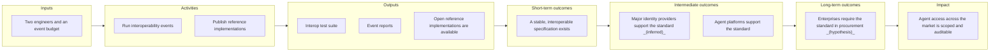

## Logic model diagram: Supply side: providers and platforms

```mermaid
flowchart LR
  subgraph stage0["Inputs"]
    n1["Two engineers and an event budget"]
  end
  subgraph stage1["Activities"]
    n2["Run interoperability events"]
    n3["Publish reference implementations"]
  end
  subgraph stage2["Outputs"]
    n4["Interop test suite"]
    n5["Event reports"]
    n6["Open reference implementations are available"]
  end
  subgraph stage3["Short-term outcomes"]
    n7["A stable, interoperable specification exists"]
  end
  subgraph stage4["Intermediate outcomes"]
    n8["Major identity providers support the standard _(inferred)_"]
    n9["Agent platforms support the standard"]
  end
  subgraph stage5["Long-term outcomes"]
    n10["Enterprises require the standard in procurement _(hypothesis)_"]
  end
  subgraph stage6["Impact"]
    n11["Agent access across the market is scoped and auditable"]
  end
  stage0 --> stage1
  stage1 --> stage2
  stage2 --> stage3
  stage3 --> stage4
  stage4 --> stage5
  stage5 --> stage6
```

